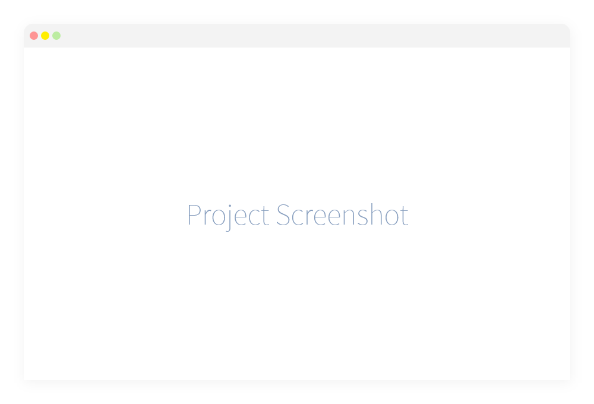

# Project Name or Logo

> *A short, clear description of the project...*

## Documentation

*Link to the documentation here or if a full documentation isn't required, make sure there are understandable installation and how-to instructions instead.*

## Team

|  |
|:-------------------------------------------------------------------------------------------------------------:|
| [Joe Mottershaw](https://github.com/joemottershaw)                                                            |

Along with the help from these [fine people](https://github.com/cloudeight/template/graphs/contributors)!

## Contributing

We appreciate you wanting to contribute to this project and would love to work with as many people as possible. All we ask is that you read our [style guidelines](https://github.com/cloudeight/style-guidelines) documentation project and please follow our [contribution guidelines](./.github/CONTRIBUTING.md) and [code of conduct](./.github/CODE_OF_CONDUCT.md).

*Don't forget to add issue and pull request templates using the GitHub [template builder](./issues/templates/edit). You can find some helpful starter templates [here](./starter)*

## License

This project is open-sourced and licensed under the [MIT License](./LICENSE).
